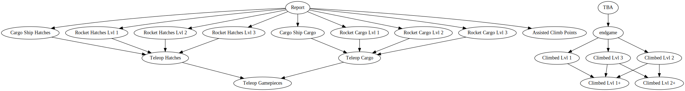

# Summary

The summary package summarizes data from many sources into a summary of how a team performed in
a match. A schema is given to specify how to summarize the data.

## Data Sources

### Match Reports

Reports are submitted by scouts. These reports consist of field names, and boolean/integer values for the auto and teleop periods. There can be multiple reports for a single team in a single match.

Example:

```json
{
   "auto":[
      {
         "name":"Sandstorm 1",
         "value":1
      },
      {
         "name":"Sandstorm 2",
         "value":0
      },
      {
         "name":"Cargo Placed",
         "value":0
      },
      {
         "name":"Hatches Placed",
         "value":0
      }
   ],
   "teleop":[
      {
         "name":"Cargo Ship Hatches",
         "value":1
      },
      {
         "name":"Cargo Ship Cargo",
         "value":0
      },
      {
         "name":"Rocket Hatches Lvl 1",
         "value":1
      },
      {
         "name":"Rocket Cargo Lvl 1",
         "value":2
      },
      {
         "name":"Rocket Hatches Lvl 2",
         "value":0
      },
      {
         "name":"Rocket Cargo Lvl 2",
         "value":0
      },
      {
         "name":"Rocket Hatches Lvl 3",
         "value":0
      },
      {
         "name":"Rocket Cargo Lvl 3",
         "value":0
      },
      {
         "name":"Climbed Lvl 1",
         "value":0
      },
      {
         "name":"Climbed Lvl 2",
         "value":1
      },
      {
         "name":"Climbed Lvl 3",
         "value":0
      },
      {
         "name":"Assisted Climb Points",
         "value":0
      }
   ]
}
```

### TBA Score Breakdowns

The blue alliance provides score breakdowns for matches. There are two breakdowns per match: one for the red alliance, and one for the blue alliance. The fields in the breakdowns are basically a map of strings to JSON types (e.g. string, number, boolean). Some of these fields are in the format of `endgameRobot{{.robotIndex}}`, where robotIndex is the 1-indexed position of the robot on the field. This maps to how TBA returns teams for matches, which allows us to pull information from score breakdowns.

Example:

```json
{
   "blue":{
      "adjustPoints":0,
      "autoPoints":15,
      "bay1":"PanelAndCargo",
      "bay2":"PanelAndCargo",
      "bay3":"PanelAndCargo",
      "bay4":"PanelAndCargo",
      "bay5":"PanelAndCargo",
      "bay6":"PanelAndCargo",
      "bay7":"PanelAndCargo",
      "bay8":"PanelAndCargo",
      "cargoPoints":27,
      "completeRocketRankingPoint":false,
      "completedRocketFar":false,
      "completedRocketNear":false,
      "endgameRobot1":"HabLevel2",
      "endgameRobot2":"HabLevel3",
      "endgameRobot3":"None",
      "foulCount":0,
      "foulPoints":0,
      "habClimbPoints":18,
      "habDockingRankingPoint":false,
      "habLineRobot1":"CrossedHabLineInSandstorm",
      "habLineRobot2":"CrossedHabLineInSandstorm",
      "habLineRobot3":"CrossedHabLineInSandstorm",
      "hatchPanelPoints":14,
      "lowLeftRocketFar":"PanelAndCargo",
      "lowLeftRocketNear":"Panel",
      "lowRightRocketFar":"Panel",
      "lowRightRocketNear":"None",
      "midLeftRocketFar":"None",
      "midLeftRocketNear":"None",
      "midRightRocketFar":"None",
      "midRightRocketNear":"None",
      "preMatchBay1":"Panel",
      "preMatchBay2":"Panel",
      "preMatchBay3":"Cargo",
      "preMatchBay6":"Cargo",
      "preMatchBay7":"Panel",
      "preMatchBay8":"Panel",
      "preMatchLevelRobot1":"HabLevel1",
      "preMatchLevelRobot2":"HabLevel2",
      "preMatchLevelRobot3":"HabLevel2",
      "rp":0,
      "sandStormBonusPoints":15,
      "techFoulCount":0,
      "teleopPoints":59,
      "topLeftRocketFar":"None",
      "topLeftRocketNear":"None",
      "topRightRocketFar":"None",
      "topRightRocketNear":"None",
      "totalPoints":74
   },
   "red":{
      "adjustPoints":0,
      "autoPoints":9,
      "bay1":"PanelAndCargo",
      "bay2":"PanelAndCargo",
      "bay3":"PanelAndCargo",
      "bay4":"PanelAndCargo",
      "bay5":"PanelAndCargo",
      "bay6":"PanelAndCargo",
      "bay7":"PanelAndCargo",
      "bay8":"Panel",
      "cargoPoints":27,
      "completeRocketRankingPoint":false,
      "completedRocketFar":false,
      "completedRocketNear":false,
      "endgameRobot1":"HabLevel1",
      "endgameRobot2":"HabLevel1",
      "endgameRobot3":"HabLevel1",
      "foulCount":0,
      "foulPoints":0,
      "habClimbPoints":9,
      "habDockingRankingPoint":false,
      "habLineRobot1":"CrossedHabLineInSandstorm",
      "habLineRobot2":"CrossedHabLineInSandstorm",
      "habLineRobot3":"CrossedHabLineInTeleop",
      "hatchPanelPoints":8,
      "lowLeftRocketFar":"None",
      "lowLeftRocketNear":"PanelAndCargo",
      "lowRightRocketFar":"None",
      "lowRightRocketNear":"PanelAndCargo",
      "midLeftRocketFar":"None",
      "midLeftRocketNear":"None",
      "midRightRocketFar":"None",
      "midRightRocketNear":"None",
      "preMatchBay1":"Panel",
      "preMatchBay2":"Panel",
      "preMatchBay3":"Panel",
      "preMatchBay6":"Panel",
      "preMatchBay7":"Panel",
      "preMatchBay8":"Panel",
      "preMatchLevelRobot1":"HabLevel1",
      "preMatchLevelRobot2":"HabLevel2",
      "preMatchLevelRobot3":"HabLevel2",
      "rp":0,
      "sandStormBonusPoints":9,
      "techFoulCount":0,
      "teleopPoints":44,
      "topLeftRocketFar":"None",
      "topLeftRocketNear":"None",
      "topRightRocketFar":"None",
      "topRightRocketNear":"None",
      "totalPoints":53
   }
}
```

### Previously Computed Properties

Sometimes we want to do summarize multiple fields that we've already summarized. For example, we might want ot compute "Climbed Lvl 1+" which should be true if "Climbed Lvl 1", "Climbed Lvl 2", or "Climbed Lvl 3" is true, or we might want to compute "Teleop Hatches" which is the sum of "Rocket Hatches Lvl 1", "Rocket Hatches Lvl 2", "Rocket Hatches Lvl 3", and "Cargo Ship Hatches".

## Analysis

Requirements:

* Handle multiple reports for a single team in a single match properly (single match with multiple identical reports shouldn't be weighted more than a single match with an identical report). Use all the reports, not just the first one or a random one.
* Don't weight score breakdown data more if there are multiple reports (only do score breakdowns for a match once)
* Use all score breakdown data for all matches, not just matches we have reports for
* Be able to reference auto fields from teleop fields

Stretch goals:

* Sort schemas by computed dependencies so ordering doesn't matter

## Schema

A schema defines how these data sources should be summarized. There is both an auto and teleop schema. Generally, schema is a list that specifies the following:

* `name` - defines the final name of the schema field _(required)_
* `type` - a type annotation for the field. Either "boolean", "number", or "string" _(required)_
* `hide` - a boolean that specifies whether the field shouldn't actually be displayed (for example if it's just used as an intermediary for another computed property and not important for humans)
* `reportReference` - the name of the report field to pull data from
* `tbaReference` - a template of the tba field to pull from (only usable template value is `{{.robotIndex}})`
* `sum` - list of `reference`'s to sum up (see below)
* `anyOf` - list of `equalExpression`'s (see below). If any of the equalExpressions evaluate to true then the stat will be true

A reference defines how to access a previously computed property and consists of the following fields:

* `name` - name of the schema field

An `equalExpression` consists of the following fields:

* `reference` (embedded)
* `equals` - value the schema field should equal

Example (teleop):

```json
[
   {
      "name":"Cargo Ship Hatches",
      "type":"number",
      "reportReference":"Cargo Ship Hatches"
   },
   {
      "name":"Cargo Ship Cargo",
      "type":"number",
      "reportReference":"Cargo Ship Cargo"
   },
   {
      "name":"Rocket Hatches Lvl 1",
      "type":"number",
      "reportReference":"Rocket Hatches Lvl 1"
   },
   {
      "name":"Rocket Cargo Lvl 1",
      "type":"number",
      "reportReference":"Rocket Cargo Lvl 1"
   },
   {
      "name":"Rocket Hatches Lvl 2",
      "type":"number",
      "reportReference":"Rocket Hatches Lvl 2"
   },
   {
      "name":"Rocket Cargo Lvl 2",
      "type":"number",
      "reportReference":"Rocket Cargo Lvl 2"
   },
   {
      "name":"Rocket Hatches Lvl 3",
      "type":"number",
      "reportReference":"Rocket Hatches Lvl 3"
   },
   {
      "name":"Rocket Cargo Lvl 3",
      "type":"number",
      "reportReference":"Rocket Cargo Lvl 3"
   },
   {
      "name":"endgame",
      "type":"string",
      "hide":true,
      "tbaReference":"endgameRobot{{.robotIndex}}"
   },
   {
      "name":"Climbed Lvl 1",
      "type":"boolean",
      "anyOf":[
         {
            "name":"endgame",
            "equals":"HabLevel1"
         }
      ]
   },
   {
      "name":"Climbed Lvl 2",
      "type":"boolean",
      "anyOf":[
         {
            "name":"endgame",
            "equals":"HabLevel2"
         }
      ]
   },
   {
      "name":"Climbed Lvl 3",
      "type":"boolean",
      "anyOf":[
         {
            "name":"endgame",
            "equals":"HabLevel3"
         }
      ]
   },
   {
      "name":"Climbed Lvl 1+",
      "type":"boolean",
      "anyOf":[
         {
            "name":"Climbed Lvl 1",
            "equals":true
         },
         {
            "name":"Climbed Lvl 2",
            "equals":true
         },
         {
            "name":"Climbed Lvl 3",
            "equals":true
         }
      ]
   },
   {
      "name":"Climbed Lvl 2+",
      "type":"boolean",
      "anyOf":[
         {
            "name":"Climbed Lvl 2",
            "equals":true
         },
         {
            "name":"Climbed Lvl 3",
            "equals":true
         }
      ]
   },
   {
      "name":"Assisted Climb Points",
      "type":"number",
      "reportReference":"Assisted Climb Points"
   },
   {
      "name":"Teleop Hatches",
      "type":"number",
      "sum":[
         {"name": "Rocket Hatches Lvl 1"},
         {"name": "Rocket Hatches Lvl 2"},
         {"name": "Rocket Hatches Lvl 3"},
         {"name": "Cargo Ship Hatches"}
      ]
   },
   {
      "name":"Teleop Cargo",
      "type":"number",
      "sum":[
         {"name": "Rocket Cargo Lvl 1"},
         {"name": "Rocket Cargo Lvl 2"},
         {"name": "Rocket Cargo Lvl 3"},
         {"name": "Cargo Ship Cargo"}
      ]
   },
   {
      "name":"Teleop Gamepieces",
      "type":"number",
      "sum":[
         {"name": "Teleop Hatches"},
         {"name": "Teleop Cargo"}
      ]
   }
]
```



## Summary Psuedo Code

```python
# python-like psuedocode

def summarize_team(team, auto_schema, teleop_schema, team_matches, team_reports):
   team_summary = {}

   for match in team_matches:
      auto_records = {}
      teleop_records = {}

      summarize_match(team, match, auto_schema, auto_records, reports, True)
      summarize_match(team, match, teleop_schema, teleop_records, reports, False)

      match_summary = {}
      for name, record in auto_records:
         match_summary.auto[name] = {max: max(record), avg: sum(record)/len(record), type: auto_schema[name].type}
      for name, record in teleop_records:
         match_summary.teleop[name] = {max: max(record), avg: sum(record)/len(record), type: teleop_schema[name].type}

      team_summary[match.key] = team_summary

def summarize_match(team, match, schema, records, reports):
   for stat_description in schema:
      if stat_description.report_reference:
         summarize_report_reference(stat_description, reports, records)
      elif stat_description.tba_reference:
         summarize_tba_reference(match, team, stat_description, records)
      elif stat_description.sum:
         summarize_sum(stat_description, records)
      elif stat_description.any_of:
         summarize_any_of(stat_description, records)

def summarize_report_reference(stat_description, reports, records):
   for report in reports:
      if report.name == stat_description.report_reference:
            records[stat_description.name].append(report.value)

def summarize_tba_reference(match, team, stat_description, records):
   index = index_of(match.red_alliance, team)
   breakdown = red_breakdown
   if index == -1:
      index = index_of(match.blue_alliance, team)
      breakdown = blue_breakdown

   if index == -1:
      continue

   key = template(stat_description.name, index)

   records[stat_description.name].append(breakdown[key])

def summarize_sum(stat_description, records):
   records_sum = 0
   for ref in stat_description.sum:
      records_sum += sum(records[ref.name])

   records[stat_description.name].append(records_sum)

def summarize_any_of(stat_description, records):
   for ref in stat_description.any_of:
      for value in source_records[ref.name]:
         if value == ref.equals:
            records[stat_description.name].append(True)
            return
   records[stat_description.name].append(False)
```